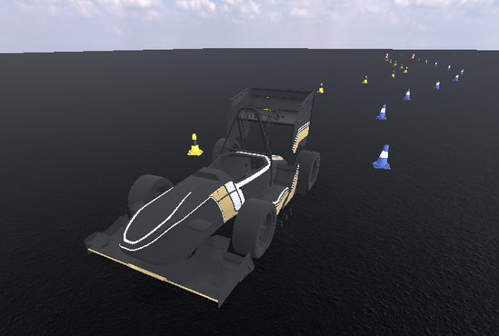

# Mirena Workspace

A ROS 2 (Jazzy) workspace for Formula Student Driverless development, built around **MirenaSim**, a
Godot 4 simulator that publishes the same interfaces as the real car.



## Packages

| Package | Description |
|---------|-------------|
| [`mirena_sim`](src/mirena_sim) | Godot simulator with GPU lidar and camera, IMU, GNSS, and random track generation |
| [`mirena_common`](src/mirena_common) | Shared message definitions (`Car`, `CarControl`, `EntityList`, `Track`, ...) |
| [`mirena_rviz2_plugins`](src/mirena_rviz2_plugins) | RViz 2 displays for the `mirena_common` messages |

## Quick start

The workspace is meant to be used through the included Dev Container (Docker, ROS 2 Jazzy,
rclgd). Open the folder in VS Code and choose **Reopen in Container**, then:

```bash
colcon build --symlink-install
source install/setup.zsh
ros2 run mirena_sim mirena_sim --ros-args -p track:=random
```

## Documentation

See [`docs/`](docs) for host setup, simulator architecture, vehicle configuration and sensor
models. To build the docs locally:

```bash
pip install -r docs/requirements.txt
make -C docs html
```

## License

MIT, see [LICENSE](LICENSE).
