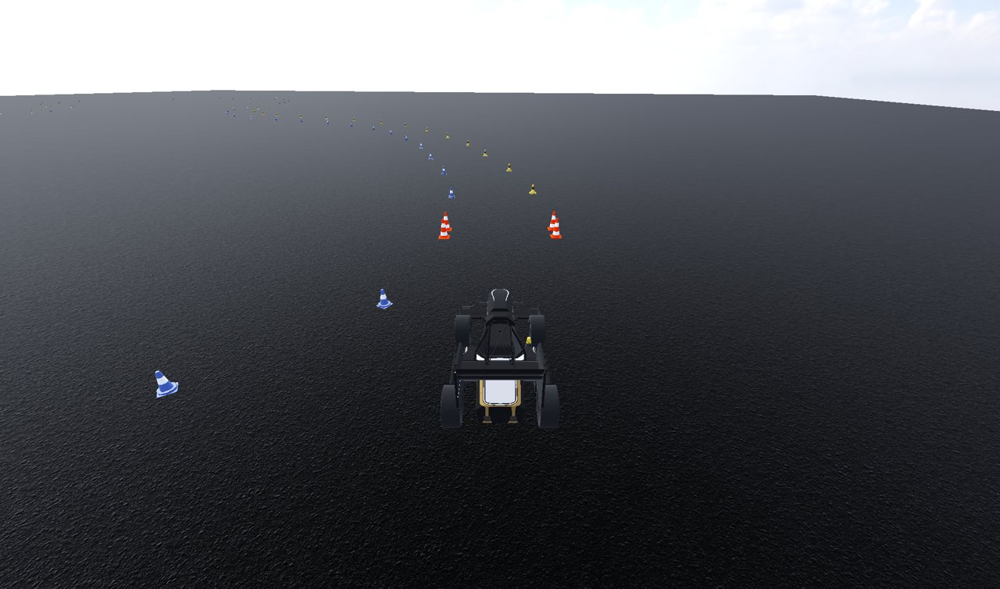

Mirena Workspace
================

**Mirena** is a ROS 2 (Jazzy) workspace for Formula Student Driverless development. At its core is
**MirenaSim**, a simulator built on the Godot 4 engine. It renders a Formula Student car on a cone
track and publishes the same ROS 2 interfaces the real car does: lidar point clouds, camera images,
IMU, GNSS and wheel speeds. An autonomous stack can be developed and tested against it without
being able to tell it apart from the car.

The workspace contains three packages:

``mirena_sim``
   The Godot simulator project. ROS 2 runs inside Godot through
   `rclgd <https://github.com/Ozuba/rclgd>`_, so every scene node can create its own publishers,
   subscribers, timers and TF broadcasters directly from GDScript.

``mirena_common``
   The message definitions shared by the simulator and the autonomous stack (``Car``,
   ``CarControl``, ``EntityList``, ``Track``, ``WheelSpeeds``, ...).

``mirena_rviz2_plugins``
   RViz 2 displays for the ``mirena_common`` messages (car, entity lists and tracks).

.. note::

   MirenaSim is under active development. Topic names and interfaces may still change between
   releases.

.. toctree::
   :maxdepth: 2
   :caption: Getting started

   getting_started/dev_environment

.. toctree::
   :maxdepth: 2
   :caption: Simulator

   simulator/overview
   simulator/vehicle

.. toctree::
   :maxdepth: 2
   :caption: Sensors

   sensors/index
   sensors/lidar
   sensors/camera
   sensors/imu
   sensors/gps
