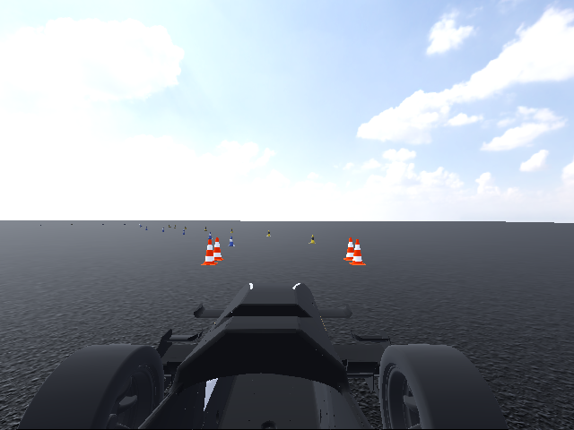
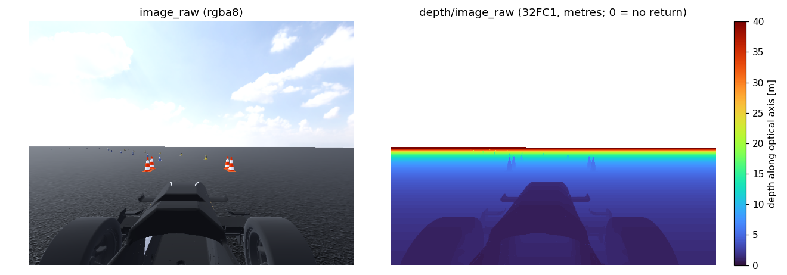
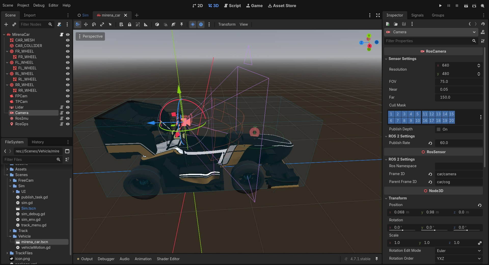

Camera (``RosCamera``)
======================

   ``/camera/image_raw`` from the default camera at the start line (640 × 480).

``RosCamera`` is an **ideal pinhole camera**. It renders the scene through its own ``Camera3D``
into an off-screen ``SubViewport``, reads the image back from the GPU, and publishes it together
with matching ``CameraInfo``. It can also publish a **depth image** that is pixel-aligned with the
colour image, computed from the same render pass.

Output
------

.. list-table::
   :header-rows: 1
   :widths: 32 30 38

   * - Topic
     - Type
     - Content
   * - ``~/image_raw``
     - ``sensor_msgs/Image``
     - ``rgba8``, ``step = 4 · width``
   * - ``~/camera_info``
     - ``sensor_msgs/CameraInfo``
     - Intrinsics, ``plumb_bob`` model with zero distortion
   * - ``~/depth/image_raw``
     - ``sensor_msgs/Image``
     - ``32FC1``: depth in metres along the optical axis, 0 = no return. Only when
       ``publish_depth`` is enabled.
   * - ``~/depth/camera_info``
     - ``sensor_msgs/CameraInfo``
     - Same intrinsics as the colour image

On the default car the node is named ``Camera``, so its topics are ``/camera/...``.

Frames
~~~~~~

Images are published in the **optical frame** ``<frame_id>_optical``, which follows the ROS camera
convention: **z forward, x right, y down**. The sensor publishes this extra static transform
itself:

.. code-block:: text

   car/cog ──► car/camera (x fwd, y left, z up) ──► car/camera_optical (z fwd, x right, y down)

Use ``car/camera`` to place the camera on the car, and ``car/camera_optical`` (the frame in the
image headers) when projecting points into the image.

Camera model
------------

The camera has square pixels and the principal point at the image centre. ``fov`` is the
**vertical** field of view, so the horizontal FOV follows from the aspect ratio:

.. math::

   f_y = \frac{h}{2\tan(\mathrm{fov}/2)},\quad f_x = f_y,\quad c_x = \frac{w}{2},\quad c_y = \frac{h}{2}

.. math::

   K = \begin{bmatrix} f_x & 0 & c_x \\ 0 & f_y & c_y \\ 0 & 0 & 1 \end{bmatrix},\qquad
   D = [0, 0, 0, 0, 0],\qquad
   P = \begin{bmatrix} f_x & 0 & c_x & 0 \\ 0 & f_y & c_y & 0 \\ 0 & 0 & 1 & 0 \end{bmatrix}

For the default 640 × 480 and 75°: :math:`f_x = f_y \approx 312.8` px and a horizontal FOV of
about 91.3°.

To match a real camera, choose ``resolution`` and ``fov`` from its calibration:
:math:`\mathrm{fov} = 2\arctan\!\big(h / (2 f_y)\big)`. The simulator doesn't model lens
distortion, rolling shutter, motion blur, exposure or sensor noise, so ``image_raw`` is
equivalent to an already rectified image.

Depth image
-----------

   With ``publish_depth`` enabled, each colour frame has a matching ``32FC1`` depth frame. The
   sky has no return (0, blank here). Ground depth increases smoothly towards the horizon, and the
   cones stand out against it.

The depth is computed in the camera's own render pass. A compositor effect runs
``DepthCapture.glsl`` after the transparent pass, linearizes Godot's reversed-Z depth buffer with
the inverse projection matrix, and writes metres along the optical axis into an ``R32F`` texture.
Depth and colour come from the same frame and camera, so they are **pixel-aligned and share
stamp, frame and intrinsics**. Back-projecting a pixel is simply

.. math::

   X = \frac{(u - c_x)\, Z}{f_x},\quad Y = \frac{(v - c_y)\, Z}{f_y},\quad Z = \text{depth}(u, v)

Depth is noise-free. Add noise downstream if you are emulating a stereo or ToF camera.

Parameters
----------

   The default ``Camera`` selected in the car scene. The gizmo draws the pinhole frustum from ``fov`` and ``resolution``. The frame IDs are under *ROS 2 Settings*.

.. list-table::
   :header-rows: 1
   :widths: 22 15 15 48

   * - Parameter
     - Default
     - Mirena car
     - Description
   * - ``resolution``
     - 640 × 480
     - 640 × 480
     - Image size in pixels
   * - ``fov``
     - 75°
     - 75°
     - **Vertical** field of view
   * - ``near`` / ``far``
     - 0.05 / 150 m
     - 0.05 / 150 m
     - Clip planes. Nothing beyond ``far`` is rendered (depth 0).
   * - ``cull_mask``
     - all layers
     - all layers
     - 3D render layers that the camera sees
   * - ``publish_depth``
     - false
     - false
     - Also publish ``depth/image_raw`` and ``depth/camera_info``
   * - ``publish_rate``
     - 15 Hz
     - 60 Hz
     - Frames per second, at most one per rendered frame

Performance
-----------

Each capture renders the whole scene again at the sensor's resolution, so cost scales with
``resolution × publish_rate``. The viewport turns off shadows, screen-space AA, debanding and HDR
2D to save time. If the simulator's frame rate falls below ``publish_rate``, the camera publishes
once per rendered frame. Check the actual rate with:

.. code-block:: bash

   ros2 topic hz /camera/image_raw --qos-reliability best_effort

Copying the image into the message and publishing it (about 0.5 ms for 640 × 480) runs on a
publish-queue thread, so it doesn't delay the frame.

.. tip::

   Many tools expect ``rgb8`` or ``bgr8``. Convert with ``cv_bridge``
   (``imgmsg_to_cv2(msg, 'bgr8')`` handles ``rgba8``), or drop the alpha channel yourself:
   ``np.frombuffer(msg.data, np.uint8).reshape(h, w, 4)[:, :, :3]``.
