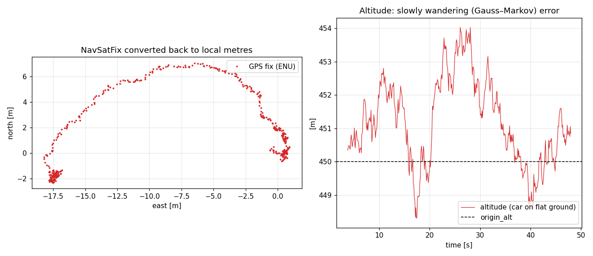
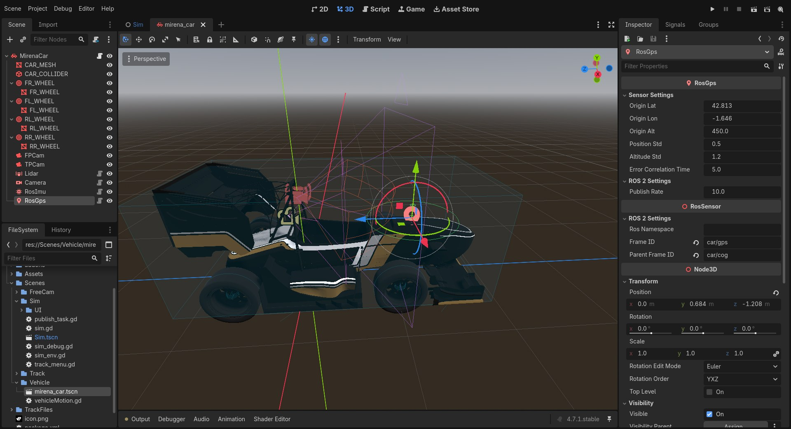

GNSS (``RosGps``)
=================

   ``/ros_gps/fix`` during the same drive as the IMU figure, converted back to local metres. Left:
   the fixes trace the car's arc, with the slowly wandering error typical of real GNSS rather than
   independent scatter. The clusters at either end are the car standing still. Right: altitude
   with :math:`\sigma = 1.2` m and a 5 s correlation time.

``RosGps`` simulates a GNSS receiver that publishes ``sensor_msgs/NavSatFix``. The Godot world is
anchored at a configurable latitude, longitude and altitude, and the sensor's position is
converted to geodetic coordinates with a **local flat-earth approximation** on the **WGS-84**
ellipsoid. A **first-order Gauss–Markov** error is added, which drifts slowly like real GNSS
error instead of jumping independently at every fix.

Output
------

.. list-table::
   :header-rows: 1
   :widths: 30 70

   * - Topic
     - ``~/fix`` → ``/ros_gps/fix`` on the default car
   * - Type
     - ``sensor_msgs/msg/NavSatFix``
   * - Status
     - ``STATUS_FIX`` (0), ``SERVICE_GPS`` (1)
   * - Covariance
     - Diagonal ``[σ_h², σ_h², σ_v²]``, ``COVARIANCE_TYPE_DIAGONAL_KNOWN`` (2)

Sensor model
------------

World frame
~~~~~~~~~~~

The Godot world, expressed in ROS axes, is treated as **ENU**: x east, y north, z up, with its
origin at ``(origin_lat, origin_lon, origin_alt)``. This matches the ``map`` convention of REP
103. The sensor's world position :math:`p` is converted to ENU and the error :math:`e` is added:

.. math::

   \text{enu} = \text{to\_ros}(p) + e

Geodetic conversion
~~~~~~~~~~~~~~~~~~~

With :math:`\varphi_0` the origin latitude, :math:`a = 6378137` m and
:math:`e^2 = f(2-f)`, :math:`f = 1/298.257223563`, the meridian and prime-vertical radii are

.. math::

   M = \frac{a(1-e^2)}{(1 - e^2\sin^2\varphi_0)^{3/2}},\qquad
   N = \frac{a}{\sqrt{1 - e^2\sin^2\varphi_0}}

and the fix is

.. math::

   \text{lat} = \text{lat}_0 + \frac{\text{enu}_y}{M}\cdot\frac{180}{\pi},\quad
   \text{lon} = \text{lon}_0 + \frac{\text{enu}_x}{N\cos\varphi_0}\cdot\frac{180}{\pi},\quad
   \text{alt} = \text{alt}_0 + \text{enu}_z

The approximation is accurate to millimetres over the few hundred metres of a Formula Student
track. Convert back the same way, or with any local-tangent-plane library, to compare against
ground truth.

Error model
~~~~~~~~~~~

At every fix (:math:`\Delta t = 1/\text{publish\_rate}`) the error vector is updated as

.. math::

   e_k = \rho\, e_{k-1} + \sqrt{1 - \rho^2}\; w_k,\qquad
   \rho = e^{-\Delta t / T_c},\qquad
   w_k \sim \mathcal N\!\big(0,\ \operatorname{diag}(\sigma_h^2, \sigma_h^2, \sigma_v^2)\big)

where :math:`T_c` is ``error_correlation_time``. The :math:`\sqrt{1-\rho^2}` factor keeps the
**stationary** standard deviation at exactly :math:`\sigma_h` / :math:`\sigma_v`, so the published
covariance is correct regardless of rate or correlation time. The first fix draws :math:`e` from
that stationary distribution. With :math:`T_c = 0` the error becomes white noise.

.. tip::

   A correlated error matters for filter tuning. A Kalman filter that assumes white GNSS noise
   will trust a slowly drifting fix too much. To test that, compare runs with
   ``error_correlation_time = 0`` and ``5``.

Parameters
----------

   ``RosGps`` selected in the car scene. The gizmo draws the antenna and a ring with radius ``position_std``. The geodetic origin and the error model are under *Sensor Settings*.

.. list-table::
   :header-rows: 1
   :widths: 28 16 56

   * - Parameter
     - Default
     - Description
   * - ``origin_lat``
     - 42.8125°
     - Latitude of the Godot origin
   * - ``origin_lon``
     - −1.6458°
     - Longitude of the Godot origin
   * - ``origin_alt``
     - 450 m
     - Altitude of the Godot origin
   * - ``position_std``
     - 0.5 m
     - Horizontal error standard deviation :math:`\sigma_h` (per axis)
   * - ``altitude_std``
     - 1.2 m
     - Vertical error standard deviation :math:`\sigma_v`
   * - ``error_correlation_time``
     - 5 s
     - Gauss–Markov time constant :math:`T_c`. ``0`` gives independent noise per fix.
   * - ``publish_rate``
     - 10 Hz
     - Fix rate

Typical settings:

.. list-table::
   :header-rows: 1

   * - Receiver
     - ``position_std``
     - ``altitude_std``
     - ``error_correlation_time``
   * - Standalone GNSS
     - 1.5–3 m
     - 3–5 m
     - 10–60 s
   * - SBAS / good sky view
     - 0.5–1 m
     - 1–2 m
     - 5–20 s
   * - RTK fixed
     - 0.01–0.02 m
     - 0.02–0.03 m
     - 1–5 s

Notes
-----

- The receiver always reports a fix. Outages, multipath and fix-type changes are not simulated.
- The ENU axes are the Godot world axes, not the track's start pose. ``debug_map`` is the
  same world frame, so ground truth for the GPS is the antenna's position in ``debug_map``.
- On the default car the fixes are in frame ``car/gps``, mounted under ``car/cog``. The antenna's
  lever arm is therefore available from TF.
