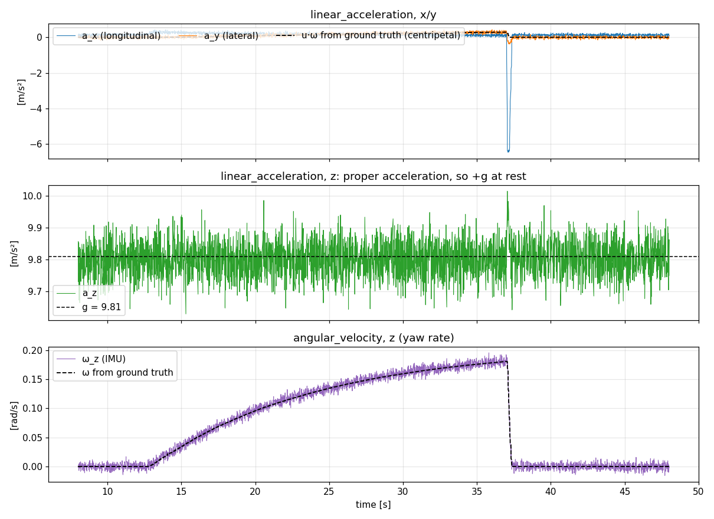
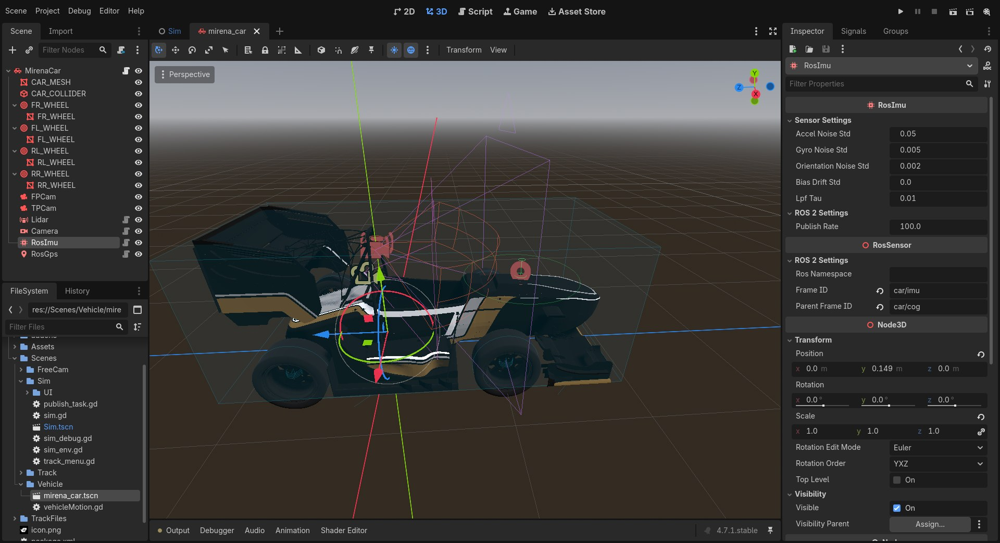

IMU (``RosImu``)
================

   ``/ros_imu/data`` while the car accelerates gently through a constant-steer turn and then brakes
   hard at t ≈ 37 s. Top: lateral acceleration follows the centripetal acceleration
   :math:`u\,\omega` computed from ground truth, and braking shows up as a −6 m/s² longitudinal
   spike. Middle: :math:`a_z` sits at +g, because an accelerometer measures proper acceleration.
   Bottom: yaw rate against ground truth.

``RosImu`` simulates a 6-axis IMU with orientation output. It measures the motion of the **nearest
``RigidBody3D`` ancestor** (the car) **at its own mount point**, adds noise and slowly drifting
biases, and publishes ``sensor_msgs/Imu``.

Output
------

.. list-table::
   :header-rows: 1
   :widths: 30 70

   * - Topic
     - ``~/data`` → ``/ros_imu/data`` on the default car
   * - Type
     - ``sensor_msgs/msg/Imu``
   * - Frame
     - ``frame_id`` (``car/imu``), axes x forward, y left, z up
   * - Fields
     - ``linear_acceleration`` [m/s²], ``angular_velocity`` [rad/s], ``orientation`` (sensor attitude in the world
       frame, quaternion) and diagonal covariances

Sensor model
------------

The IMU runs in ``_physics_process``, so it samples **every physics tick (400 Hz)** and publishes
on the tick closest to each ``1 / publish_rate`` period.

Accelerometer
~~~~~~~~~~~~~

The accelerometer differentiates the velocity **of the mount point**, not of the centre of mass,
so an off-centre IMU feels the same tangential (:math:`\alpha \times r`) and centripetal
(:math:`\omega \times (\omega \times r)`) terms as a real one:

.. math::

   v_k = \text{velocity at } r_{\text{imu}},\qquad
   a^{w}_k = \frac{v_k - v_{k-1}}{\Delta t} - g^{w}

Subtracting gravity (:math:`g^w = (0, -9.81, 0)` in Godot) gives the **proper acceleration**:
a car at rest reads :math:`a_z \approx +9.81` m/s². The world-frame value is rotated into the
sensor frame and passed through a first-order **low-pass filter** that smooths the impulses of the
physics solver:

.. math::

   \bar a_k = \bar a_{k-1} + \big(1 - e^{-\Delta t/\tau}\big)(a_k - \bar a_{k-1})

Gyroscope and orientation
~~~~~~~~~~~~~~~~~~~~~~~~~

The angular velocity is the rigid body's angular velocity, rotated into the sensor frame. The
orientation is the sensor's global rotation, perturbed by a small random rotation each sample.

Noise and bias
~~~~~~~~~~~~~~

At publish time:

.. math::

   \tilde a = \bar a + b_a + n_a,\quad n_a \sim \mathcal N(0, \sigma_a^2 I)

.. math::

   \tilde\omega = \omega + b_g + n_g,\quad n_g \sim \mathcal N(0, \sigma_g^2 I)

and on every physics tick the biases follow a **random walk**:

.. math::

   b_{k+1} = b_k + \mathcal N\!\big(0,\ (\sigma_b \sqrt{\Delta t})^2 I\big)

``bias_drift_std`` (:math:`\sigma_b`) is the random-walk intensity in units/√s. It is the same for
both sensors. After time :math:`t` the bias has a standard deviation of about
:math:`\sigma_b\sqrt t`, which is about 0.008 after 100 minutes with the default 1e-4.

Covariances
~~~~~~~~~~~

The covariance matrices are diagonal with :math:`\sigma^2` from the white-noise parameters,
floored at 1e-9. An all-zero covariance means "unknown" in ROS, and factor-graph back-ends such as
GTSAM need non-zero diagonals. The bias random walk is **not** included in the published
covariance, just as with a real IMU driver.

Parameters
----------

   ``RosImu`` selected in the car scene. The gizmo shows the sensor axes, and the noise and filter parameters are under *Sensor Settings*.

.. list-table::
   :header-rows: 1
   :widths: 26 14 60

   * - Parameter
     - Default
     - Description
   * - ``accel_noise_std``
     - 0.05 m/s²
     - Accelerometer white noise :math:`\sigma_a`
   * - ``gyro_noise_std``
     - 0.005 rad/s
     - Gyroscope white noise :math:`\sigma_g`
   * - ``orientation_noise_std``
     - 0.002 rad
     - Orientation noise per axis
   * - ``bias_drift_std``
     - 0.0001 /√s
     - Bias random walk, applied to both accelerometer and gyroscope
   * - ``lpf_tau``
     - 0.01 s
     - Accelerometer low-pass time constant. ``0`` disables the filter.
   * - ``publish_rate``
     - 100 Hz
     - Capped at the physics rate (400 Hz). A warning is printed if it is set higher.

To match a datasheet, convert noise densities to per-sample standard deviations with the
bandwidth: :math:`\sigma = \text{ND} \cdot \sqrt{f_s / 2}` for noise density ND (units/√Hz)
sampled at :math:`f_s`.

Notes
-----

- The IMU must have a ``RigidBody3D`` (for example the ``VehicleBody3D`` car) among its
  ancestors. Otherwise it prints a warning and publishes nothing.
- In the ``TRACK_RAIL`` pilot mode the car is moved kinematically, so accelerations are not
  physically meaningful.
- Mount the IMU close to the car's centre of mass if your estimator assumes the IMU frame is the
  body frame. Otherwise use the lever arm from TF (``car/cog → car/imu``).
