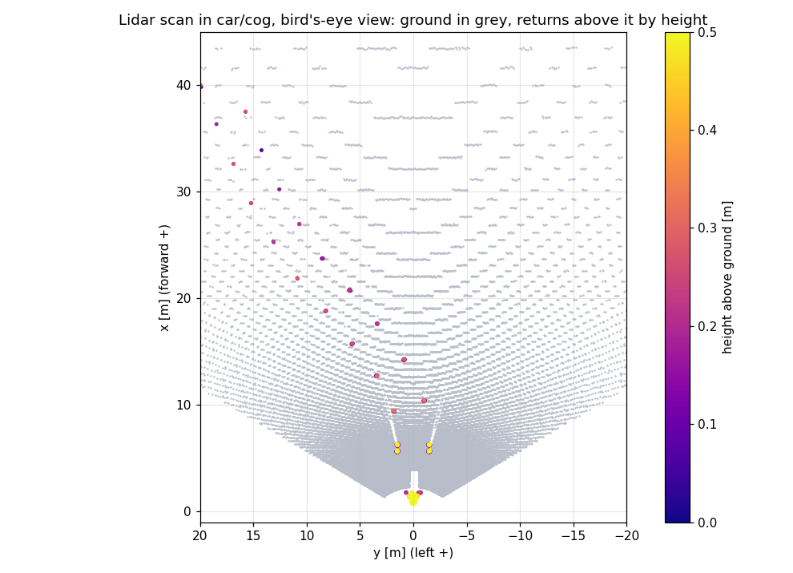
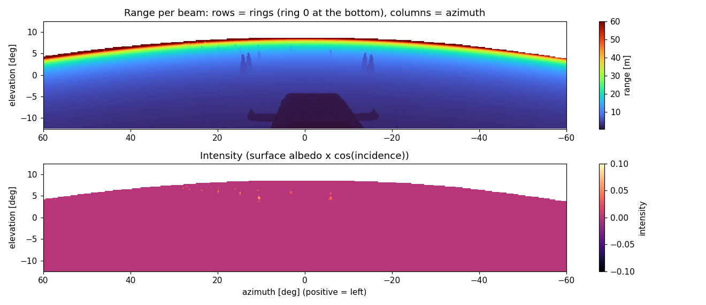
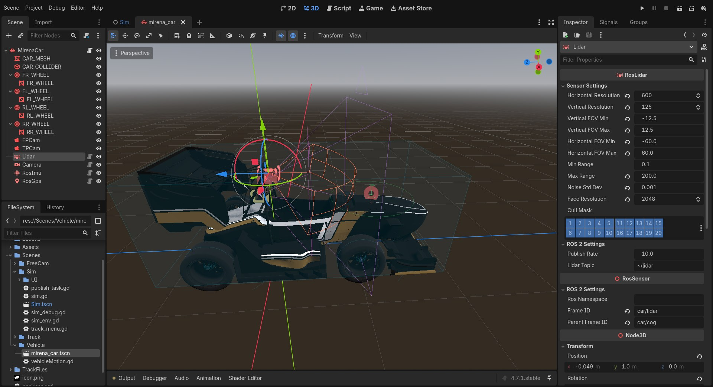
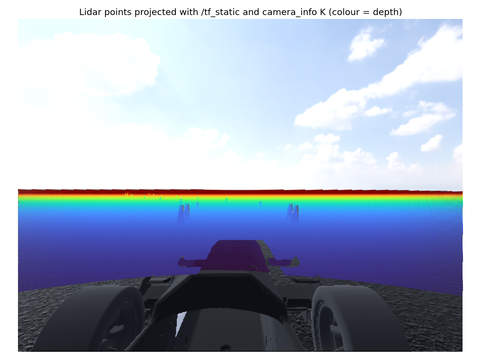

Lidar (``RosLidar``)
====================

   One scan of the default lidar at the start line, transformed into ``car/cog``. Ground returns
   are shown in grey and everything above the ground is coloured by height. The two rows of cones
   are clearly separated from the asphalt. The yellow returns at x ≈ 1 m are the car's own
   nose.

``RosLidar`` simulates a scanning lidar by rendering the scene into a **cube map** on the GPU,
then computing the range along each beam in a compute shader. The result is published as an
**organized** ``sensor_msgs/PointCloud2``: one row per beam (ring) and one column per azimuth
step, laid out in GPU memory exactly as the message expects, so it is published without any
conversion on the CPU.

Output
------

.. list-table::
   :header-rows: 1
   :widths: 30 70

   * - Topic
     - ``~/lidar`` → ``/<node>/lidar`` (``lidar_topic``); ``/lidar/lidar`` on the default car
   * - Type
     - ``sensor_msgs/msg/PointCloud2``
   * - Frame
     - ``frame_id`` (``car/lidar`` on the default car)
   * - Layout
     - ``height = vertical_resolution`` (rings), ``width = horizontal_resolution``,
       ``is_dense = false``
   * - Point fields
     - ``x``, ``y``, ``z``, ``intensity`` (``float32``, offsets 0/4/8/12), ``ring`` (``uint16``,
       offset 16), padded to ``point_step = 20`` bytes
   * - No return
     - ``x = y = z = NaN``, ``intensity = 0``

Ring 0 is the **lowest** beam and column 0 is ``horizontal_fov_min``. Because the cloud is
organized, ``(row, col)`` neighbours are neighbouring beams. This makes range-image methods
(ground segmentation along a column, clustering in image space) straightforward:

   The same scan viewed as an image: rows are rings and columns are azimuth (positive = left).
   The car's 10° downward pitch puts the horizon at about +8° in the sensor frame. Above it,
   beams return NaN (shown blank). Cones are the vertical streaks. The intensity image shows how
   much brighter they are than the asphalt.

How it works
------------

.. mermaid::

   flowchart LR
     A["6 cameras, 90° FOV (cube map faces)"] --> B["LidarFaceCapture.glsl per face: depth + intensity"]
     B --> C["LidarStitch.glsl per beam: pick face, sample, reconstruct, add noise"]
     C --> D["Points buffer (PointCloud2 layout)"]
     D -- async readback --> E["PublishQueue thread publish"]

1. **Face rendering.** Six ``SubViewport`` cameras with a 90° FOV and resolution
   ``face_resolution`` form a cube around the sensor, with ``near = min_range`` and
   ``far = max_range``. Only the faces that intersect the configured FOV are rendered. A
   120° × 25° forward lidar needs three faces (left, forward, right), not six. The lidar cameras
   use an environment with all post-processing disabled.

2. **Face capture** (``LidarFaceCapture.glsl``). A compositor effect runs in each face's render
   pass. It reads the depth buffer and the colour buffer and writes depth plus an **intensity**
   value to a ``RGBA32F`` texture:

   .. math::

      I = \underbrace{\tfrac{R+G+B}{3}}_{\text{surface brightness}} \cdot
          \underbrace{\lvert \hat n \cdot \hat d \rvert}_{\text{incidence}}

   The surface normal :math:`\hat n` is reconstructed from neighbouring depth samples, and
   :math:`\hat d` is the ray direction. This is a Lambertian model: bright, face-on surfaces such
   as the white stripes on the cones return strongly, while dark asphalt at a grazing angle
   returns almost nothing.

3. **Stitching** (``LidarStitch.glsl``). One invocation runs per output point
   ``(col, ring)``:

   - azimuth :math:`\theta` and elevation :math:`\varphi` are spaced uniformly across the FOV,
     with each beam at the centre of its cell:

     .. math::

        \theta = \theta_{\min} + \tfrac{col + 0.5}{W}(\theta_{\max} - \theta_{\min}),\qquad
        \varphi = \varphi_{\min} + \tfrac{ring + 0.5}{H}(\varphi_{\max} - \varphi_{\min})

   - the cube face is chosen by the largest component of the ray direction, and the face texel
     is looked up (nearest neighbour)
   - the hit point is reconstructed from depth with that face's inverse projection, then
     transformed back to the sensor frame. Its range :math:`r` is checked against
     ``[min_range, max_range]``
   - Gaussian noise is added **along the ray** (see below), and the point is written in ROS axes

4. **Readback and publish.** The points buffer is read back asynchronously and pushed to the
   publish queue, together with the timestamp of when the scan was requested.

Noise model
~~~~~~~~~~~

The measured range is :math:`\tilde r = \max(r + \epsilon,\ r_{\min})` with
:math:`\epsilon \sim \mathcal N(0, \sigma^2)` and

.. math::

   \sigma = \sigma_0 \cdot \frac{1}{\max(I, 0.05)} \cdot \left(1 + 0.001\, r^2\right)

where :math:`\sigma_0` is ``noise_std_dev``. The noise grows **quadratically with distance**
(signal attenuation) and is **larger on dark or grazing surfaces** (low intensity). The point
moves along its beam, so the azimuth and elevation stay exact, as on a real lidar.

.. note::

   Because of the :math:`1/I` factor, the effective noise on dark asphalt (:math:`I < 0.05`) is
   20 × ``noise_std_dev``. This is why the default car uses a small ``noise_std_dev`` of 1 mm. Tune
   it against real recordings of your sensor, ideally on both cones and ground.

Parameters
----------

   The default ``Lidar`` selected in the car scene. The gizmo shows the 120° × 25° scan volume,
   pitched 10° down. The Inspector groups the model parameters under *Sensor Settings* and the
   topic and frames under the two *ROS 2 Settings* groups.

.. list-table::
   :header-rows: 1
   :widths: 24 13 13 50

   * - Parameter
     - Default
     - Mirena car
     - Description
   * - ``horizontal_resolution``
     - 1024
     - 600
     - Columns (azimuth steps) per scan
   * - ``vertical_resolution``
     - 64
     - 125
     - Rings (beams)
   * - ``horizontal_fov_min`` / ``_max``
     - −180° / 180°
     - −60° / 60°
     - Azimuth range. Positive is **right** in the parameter; the published y is left-positive.
   * - ``vertical_fov_min`` / ``_max``
     - −45° / 45°
     - −12.5° / 12.5°
     - Elevation range relative to the sensor
   * - ``min_range`` / ``max_range``
     - 0.1 / 100 m
     - 0.1 / 200 m
     - Returns outside this interval are NaN. Also the near and far planes of the face cameras.
   * - ``noise_std_dev``
     - 0.005 m
     - 0.001 m
     - :math:`\sigma_0` in the noise model
   * - ``face_resolution``
     - 256
     - 2048
     - Pixels per cube-face side. ``0`` uses ``nearest_po2(horizontal_resolution / 4)``,
       clamped to 64–1024.
   * - ``cull_mask``
     - all layers
     - all layers
     - 3D render layers that the lidar sees
   * - ``publish_rate``
     - 10 Hz
     - 10 Hz
     - Scans per second, at most one per rendered frame
   * - ``lidar_topic``
     - ``~/lidar``
     - ``~/lidar``
     - Output topic

Choosing ``face_resolution``
~~~~~~~~~~~~~~~~~~~~~~~~~~~~

Each beam reads **one texel** of a face, so the face resolution limits angular accuracy. A face
spans 90° over ``face_resolution`` pixels, which gives about ``90° / face_resolution`` per texel
at the centre of the face (finer towards the edges). Keep this below your beam spacing:

- default car: beam spacing 120°/600 = 0.2° horizontally and 25°/125 = 0.2° vertically. With a
  2048 px face, a texel is about 0.044°, about 4.5 texels per beam, which is very accurate.
- a 360° × 64-beam rotating lidar with ``horizontal_resolution = 1024`` (0.35°) works well with
  512–1024 px faces.

Rendering cost grows with the square of ``face_resolution`` and linearly with the number of
faces rendered. Narrowing the FOV is the cheapest optimization.

Projecting into the camera
--------------------------

The lidar and the camera publish consistent static transforms and intrinsics, so sensor-fusion
code can be checked directly against the simulator:

   Lidar points transformed into ``car/camera_optical`` with ``/tf_static`` and projected with
   ``camera_info.K``. The points line up with the cones and with the car's nose in the image.

Limitations
-----------

- **No motion distortion.** All beams of a scan come from the same instant. Real spinning
  lidars sweep over about 100 ms, so a deskewing step will see no skew to correct.
- **One return per beam**, no beam divergence, no rain, dust or multipath.
