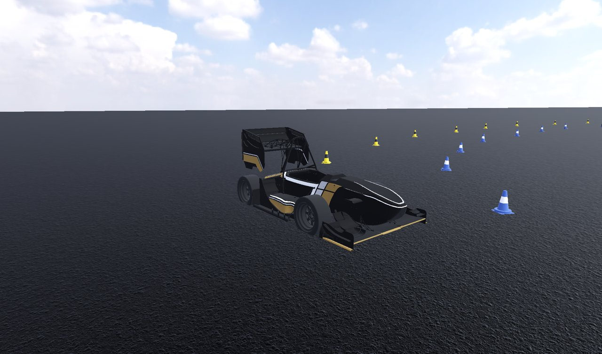
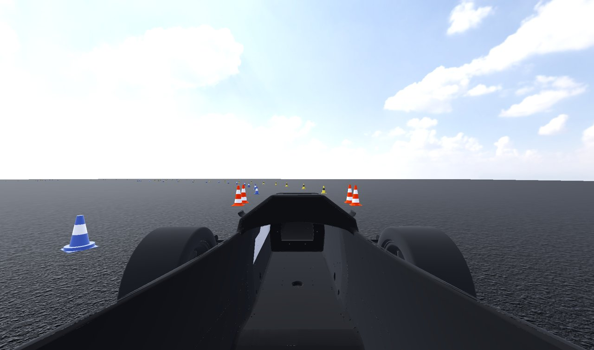
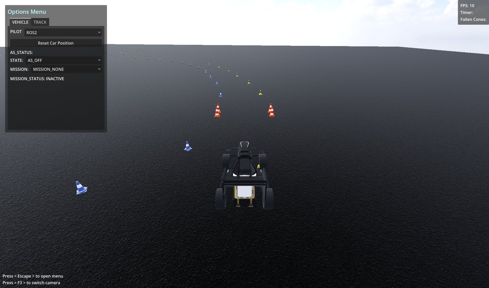
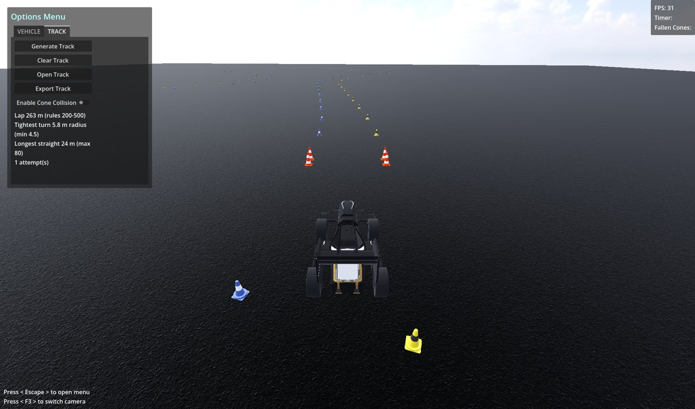
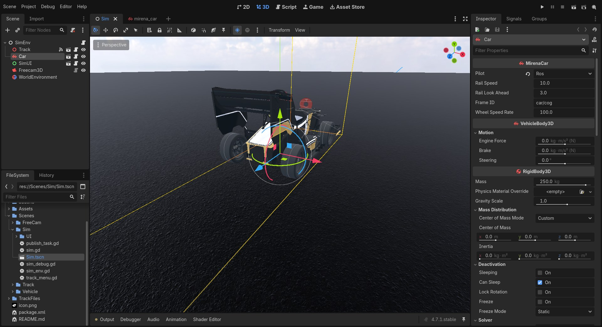
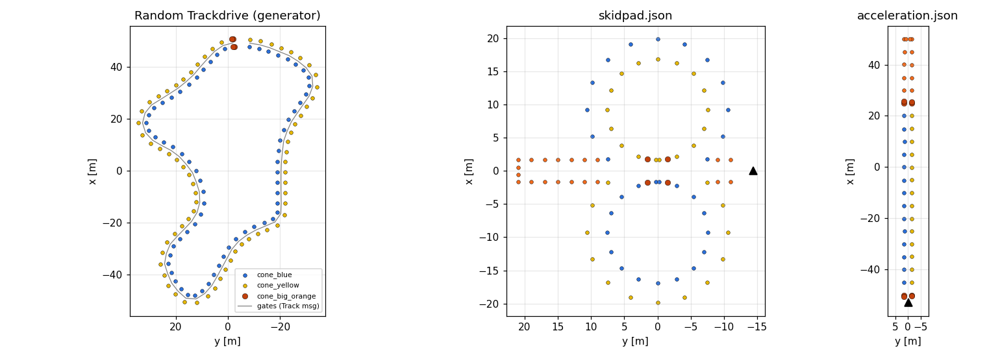
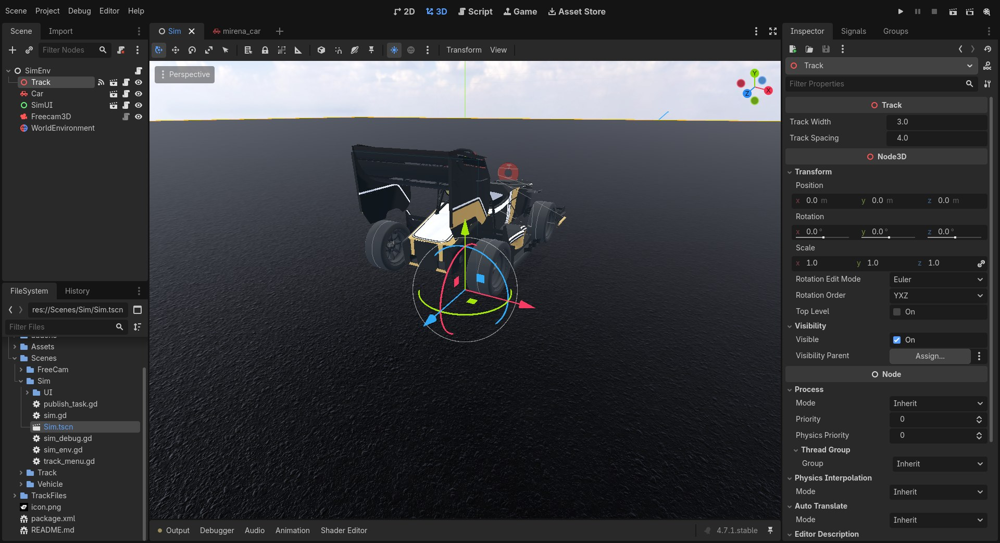

Simulator overview and architecture
===================================

MirenaSim is a Godot 4 project (Forward+ renderer, Vulkan) that acts as a set of ROS 2 nodes. It
simulates one Formula Student car on a flat asphalt plane with a cone track, and provides:

- vehicle dynamics from Godot's ``VehicleBody3D`` raycast-suspension model, stepped at **400 Hz**
- GPU-rendered **lidar** and **camera** (with optional depth) sensors, an **IMU**, a **GNSS**
  receiver and rear **wheel speeds**
- tracks loaded from JSON (skidpad and acceleration are bundled) or **generated randomly**
  within the Formula Student Trackdrive rules
- ground truth (car state, cones, track centreline) on separate debug topics, for evaluating
  perception, SLAM and state estimation

Running it
----------

.. code-block:: bash

   ros2 run mirena_sim mirena_sim --ros-args -p track:=random

Every node accepts standard ROS arguments after ``--ros-args``. Project settings under
``ros/parameters/*`` in ``project.godot`` (``use_sim_time`` and ``use_separate_thread``) are passed
as parameters as well, unless the command line overrides them.

Controls
~~~~~~~~

.. list-table::
   :header-rows: 1
   :widths: 30 25 25

   * - Action
     - Keyboard
     - Gamepad
   * - Throttle
     - :kbd:`W`
     - right trigger
   * - Brake
     - :kbd:`S`
     - left trigger
   * - Steer left / right
     - :kbd:`A` / :kbd:`D`
     - left stick
   * - Emergency brake (manual pilot)
     - :kbd:`Space`
     -
   * - Cycle camera (chase → onboard → free)
     - :kbd:`F3`
     -
   * - Show / hide the options menu
     - :kbd:`Esc`
     -
   * - Free camera: move / up / down
     - :kbd:`W` :kbd:`A` :kbd:`S` :kbd:`D` / :kbd:`Space` / :kbd:`Shift`
     -
   * - Free camera: speed
     - mouse wheel
     -
   * - Free camera: release mouse
     - :kbd:`Tab`
     -

The keyboard driving controls only act in the **Manual** pilot mode
(see :ref:`simulator/vehicle:Pilot modes`).

   The onboard (driver's-eye) camera. These viewer cameras are separate from the ROS camera
   sensor: they only draw to the window and publish nothing.

The options menu
~~~~~~~~~~~~~~~~

:kbd:`Esc` opens the options menu, which has two tabs.

   **VEHICLE** tab: pilot mode, *Reset Car Position*, and the AS state and mission the car
   reports on ``/as_status``. The mission status shown is the last value received on
   ``/system/mission_status``.

   **TRACK** tab: generate a random track, clear it, open a ``.json`` track, export the current
   track, and enable collisions between the car and the cones. After generating a track, the panel
   shows how it compares with the rules: lap length, tightest turn radius and longest straight.

The stats panel in the top-right corner shows the frame rate.

Architecture
------------

Godot organises the simulator as a tree of scenes. Instead of one monolithic bridge, each
ROS-facing node in that tree **owns its own ROS node** through ``rclgd``. The car, the track
manager and every sensor publish independently, with their own rates and QoS.

.. mermaid::

   flowchart TB
     subgraph Godot["Godot process"]
       direction TB
       AL1["rclgd_init (autoload) rclgd.init(args) / shutdown()"]
       AL2["Sim (autoload) car, track refs, camera manager"]
       subgraph SimTscn["Sim.tscn"]
         ENV["SimEnv (sim_env.gd)"]
         TR["Track (track.gd) ROS node: track_manager"]
         CAR["Car: MirenaCar (VehicleBody3D) ROS node: mirena_car"]
         UI[SimUI]
         FC[Freecam3D]
         subgraph Sensors["Sensors (children of Car)"]
           L["Lidar: RosLidar ROS node: lidar"]
           C["Camera: RosCamera ROS node: camera"]
           I["RosImu ROS node: ros_imu"]
           G["RosGps ROS node: ros_gps"]
         end
       end
       EX["rclgd executor thread"]
     end
     Stack["Autonomous stack (perception, SLAM, planning, control)"]
     L -- /lidar/lidar --> Stack
     C -- /camera/image_raw, camera_info --> Stack
     I -- /ros_imu/data --> Stack
     G -- /ros_gps/fix --> Stack
     CAR -- /sensors/wheel_speeds, /as_status --> Stack
     Stack -- /control --> CAR
     Stack -- /system/mission_status --> CAR
     TR -. /track_manager/* ground truth .-> Stack
     CAR -. /debug/* ground truth .-> Stack

Main components
~~~~~~~~~~~~~~~

   ``Scenes/Sim/Sim.tscn``, the main scene, in the editor. ``SimEnv`` holds the ``Track``, the
   ``Car`` (an instance of ``mirena_car.tscn``), the ``SimUI`` overlay, the ``Freecam3D`` and the
   ``WorldEnvironment`` (sky and lighting). With ``Car`` selected, the Inspector shows the default
   pilot mode (``Ros``).

``rclgd_init`` autoload (``addons/rclgd/ros_init.gd``)
   Runs before any scene. It collects the command-line ROS arguments plus the
   ``ros/parameters/*`` project settings, calls ``rclgd.init()``, and shuts the ROS context down
   when the game exits. With ``use_separate_thread`` enabled, ROS callbacks run on their own
   executor thread, so a slow frame doesn't delay message handling.

``Sim`` autoload (``Scenes/Sim/sim.gd``)
   Global access point: ``Sim.car`` and ``Sim.track`` (set by ``SimEnv``), command-line argument
   parsing, and the viewer camera manager behind :kbd:`F3`.

``Track`` (``Scenes/Track/track.gd``, ROS node ``track_manager``)
   Builds tracks from JSON or from ``TrackGenerator``, places cones and gates, defines the car's
   start pose (``origin``), and publishes the ground-truth map and track. Its exported
   ``track_width`` and ``track_spacing`` set the cone layout of generated tracks.

``MirenaCar`` (``Scenes/Vehicle/vehicleMotion.gd``, ROS node ``mirena_car``)
   The vehicle: drivetrain, steering, pilot modes, the ``/control`` subscription, wheel speeds,
   AS status, and ground-truth debug topics. See :doc:`vehicle`.

Sensors (``addons/rclgd-sensors``)
   Reusable node types (``RosLidar``, ``RosCamera``, ``RosImu``, ``RosGps``) that you attach to the
   car like any other node. Each one publishes its mount transform on ``/tf_static`` and its data
   on its own topics. See :doc:`../sensors/index`.

Threads and timing
~~~~~~~~~~~~~~~~~~

The simulator spreads work over several threads:

.. list-table::
   :header-rows: 1
   :widths: 25 75

   * - Thread
     - Work
   * - Physics (400 Hz)
     - ``VehicleBody3D`` integration, the drivetrain (``_apply_vehicle_physics``), IMU sampling,
       and ``/debug/state/car`` publishing. ``physics/3d/run_on_separate_thread`` is enabled, with
       up to 20 physics steps per rendered frame.
   * - Main / render
     - Scene updates and rendering of the window and of the sensor viewports. GPU compute
       passes for depth and lidar run from compositor effects inside the sensor cameras' own
       render passes.
   * - ROS executor
     - Subscription callbacks (``/control``, ``/system/mission_status``) and ``RosTimer``
       callbacks, which drive sensor sampling and the periodic publishers.
   * - Publish queues
     - One worker thread per GPU sensor stream. It copies the read-back buffer into the ROS
       message and publishes it, so large images and clouds never stall a frame.

GPU sensors are therefore asynchronous. A capture is stamped when it is requested
(``_node.now()``), rendered in the next frame, read back with a few frames' latency, and published
in capture order. The header stamp is the moment the scene was rendered, not the moment the
message left the simulator.

.. note::

   Simulation time is wall-clock time (``use_sim_time:=false``). If rendering cannot keep up with
   the requested sensor rates, sensors publish less often than configured, but the stamps remain
   correct. Watch the FPS counter when you add sensors or raise their resolution.

Coordinate frames
-----------------

Godot is **Y-up** with **-Z forward**. ROS uses **REP 103**: X forward, Y left, Z up. Every value
that crosses into ROS is converted:

.. list-table::
   :header-rows: 1

   * - ROS axis
     - Godot expression
   * - x (forward)
     - −z
   * - y (left)
     - −x
   * - z (up)
     - +y

The helpers ``RosSensor.to_ros()`` and ``RosSensor.to_ros_quat()`` implement this mapping. The
change of axes is a proper rotation, so quaternions map the same way vectors do.

TF tree
~~~~~~~

The default car publishes the following static transforms:

.. code-block:: text

   car/cog                        (car body frame; parent provided by your state estimator)
   ├── car/lidar                  static, from RosLidar
   ├── car/camera                 static, from RosCamera
   │   └── car/camera_optical     static (z forward, x right, y down)
   ├── car/imu                    static, from RosImu
   ├── car/gps                    static, from RosGps
   └── debug_odom                 dynamic, ground truth (see below)
       └── debug_map              static, re-sent when the start pose changes

``car/cog`` deliberately has no parent from the simulator. The ``odom → car/cog`` transform
belongs to the state estimator of your stack, just as it does on the real car. Ground truth hangs
**below** the car as ``car/cog → debug_odom → debug_map``. This keeps ``car/cog`` with a single
parent, and in RViz it lets you see the true world around the estimated car (fixed frame ``map``)
or the estimate drifting over the true world (fixed frame ``debug_map``).

``debug_odom`` is the start pose of the current track, and ``debug_map`` is the Godot world
origin. Both ground-truth transforms are planar (x, y, yaw), so body roll and pitch don't tilt the
world.

Topics
------

Stack-facing interfaces
~~~~~~~~~~~~~~~~~~~~~~~

These are the topics a real car provides as well, and the ones your stack should use.

.. list-table::
   :header-rows: 1
   :widths: 30 30 10 30

   * - Topic
     - Type
     - Rate
     - Notes
   * - ``/lidar/lidar``
     - ``sensor_msgs/PointCloud2``
     - 10 Hz
     - Organized cloud, frame ``car/lidar``. See :doc:`../sensors/lidar`.
   * - ``/camera/image_raw``
     - ``sensor_msgs/Image``
     - 60 Hz
     - ``rgba8``, frame ``car/camera_optical``. See :doc:`../sensors/camera`.
   * - ``/camera/camera_info``
     - ``sensor_msgs/CameraInfo``
     - 60 Hz
     - Pinhole intrinsics, no distortion.
   * - ``/ros_imu/data``
     - ``sensor_msgs/Imu``
     - 100 Hz
     - Frame ``car/imu``. See :doc:`../sensors/imu`.
   * - ``/ros_gps/fix``
     - ``sensor_msgs/NavSatFix``
     - 10 Hz
     - See :doc:`../sensors/gps`.
   * - ``/sensors/wheel_speeds``
     - ``mirena_common/WheelSpeeds``
     - 100 Hz
     - Rear wheel RPM (``rl``, ``rr``). Best effort.
   * - ``/as_status``
     - ``mirena_common/AsInfo``
     - 10 Hz
     - AS state and mission, as selected in the VEHICLE tab.
   * - ``/control`` (subscribed)
     - ``mirena_common/CarControl``
     - —
     - ``gas`` ∈ [−1, 1] (−1 = full braking, never reverse) and ``steer_angle`` in radians, CCW
       positive. Used in the ROS pilot mode.
   * - ``/system/mission_status`` (subscribed)
     - ``mirena_common/MissionInfo``
     - —
     - Shown in the VEHICLE tab.

Ground truth and debugging
~~~~~~~~~~~~~~~~~~~~~~~~~~

Don't feed these to the pipeline. Use them to evaluate it.

.. list-table::
   :header-rows: 1
   :widths: 32 30 10 28

   * - Topic
     - Type
     - Rate
     - Notes
   * - ``/debug/state/car``
     - ``mirena_common/Car``
     - 400 Hz
     - True pose (x, y, ψ) in ``debug_odom`` and body velocities (u, v, ω).
   * - ``/debug/perception``
     - ``mirena_common/EntityList``
     - 10 Hz
     - Cones within 12 m that are inside the camera frustum, in ``car/cog``.
   * - ``/debug/slam``
     - ``mirena_common/EntityList``
     - 10 Hz
     - Every cone seen so far, in ``debug_map``. Cleared on reset.
   * - ``/inferred_control``
     - ``mirena_common/CarControl``
     - 10 Hz
     - The gas and steering actually applied to the car.
   * - ``/track_manager/full_map``
     - ``mirena_common/EntityList``
     - 1 Hz
     - All cones, in ``debug_map``.
   * - ``/track_manager/track``
     - ``mirena_common/Track``
     - 1 Hz
     - Centreline gates (x, y, ψ) every ``track_spacing`` metres, in ``debug_map``.

Tracks
------

   Left: a generated Trackdrive layout as published on ``/track_manager/full_map``, with the
   gates from ``/track_manager/track``. Centre and right: the bundled ``skidpad.json`` and
   ``acceleration.json``. The triangles mark the car's start pose.

Cones come in the four Formula Student types: ``cone_blue`` (left boundary), ``cone_yellow``
(right boundary), ``cone_orange`` and ``cone_big_orange`` (start, finish and timing lines). Cones
are in the ``Cones`` group. Collisions between the car and the cones are **off** by default and
can be enabled in the TRACK tab.

Loading a track
~~~~~~~~~~~~~~~

Choose the track with the ``track`` parameter of ``track_manager``, either at launch or at
runtime:

.. code-block:: bash

   ros2 run mirena_sim mirena_sim --ros-args -p track:=/abs/path/to/skidpad.json
   ros2 param set /track_manager track random

The *Open Track* button in the TRACK tab loads a file as well. Every new track moves the car to
the track's start pose and resets the ground-truth SLAM map.

Track file format
~~~~~~~~~~~~~~~~~

All coordinates are in ROS axes (x forward, y left) and in metres. *Export Track* writes the same
format, relative to the car's start pose, so exported tracks can be used directly as planner test
cases.

.. code-block:: json

   {
     "metadata": {"track_name": "FSG Skidpad", "description": "...", "date": "2026-01-23"},
     "setup":    {"car_start_pose": {"x": 0.0, "y": -14.4, "psi": 1.57}},
     "cones": [
       {"type": "cone_blue",   "x": -1.637, "y": 0.2},
       {"type": "cone_yellow", "x":  1.500, "y": 0.2}
     ],
     "path": {"closed": true, "points": [{"x": 0.0, "y": 0.0}, {"x": 4.0, "y": 0.1}]}
   }

``path`` is optional. When it is present, it defines the centreline used for
``/track_manager/track`` and for the *Track rail* pilot mode.

Random Trackdrive generation
~~~~~~~~~~~~~~~~~~~~~~~~~~~~

``TrackGenerator`` (``Scenes/Track/track_generator.gd``) generates closed layouts that comply
with the Formula Student rules:

1. **Shape.** Threshold a Perlin noise map and take the outline of a blob. This produces
   chicanes, hairpins and decreasing-radius turns naturally.
2. **Smoothing.** Chaikin corner cutting (4 iterations), then resampling every 2 m.
3. **Corner opening.** 400 rounds of curvature relaxation, so the loop can be scaled to a legal
   corner radius without exceeding the maximum lap length.
4. **Fit to the rules.** Scale the layout and measure it on the *baked* curve, which is what the
   gates are placed on. A candidate is rejected and redrawn (up to 40 attempts) if it breaks any of
   these limits:

   .. list-table::
      :header-rows: 1

      * - Rule
        - Limit
      * - D 1.1.10, minimum turning diameter
        - 9 m (4.5 m radius, built with a 1.25× margin)
      * - D 8.1.1, maximum straight
        - 80 m
      * - D 8.1.1, minimum track width
        - 3 m (``Track.track_width``)
      * - D 8.1.2, lap length
        - 200–500 m
      * - Self clearance
        - 8 m between non-adjacent parts of the loop

If no candidate passes, the generator falls back to a circle and reports it in the TRACK tab.
Gates are placed every ``track_spacing`` (4 m, below the rules' 5 m maximum), and the car lines
up 6 m behind the start line. Both ``track_width`` and ``track_spacing`` are set on the ``Track``
node:

   The ``Track`` node in ``Sim.tscn``. ``track_width`` is the distance between the blue and
   yellow cones of a gate, and ``track_spacing`` is the distance between gates.
