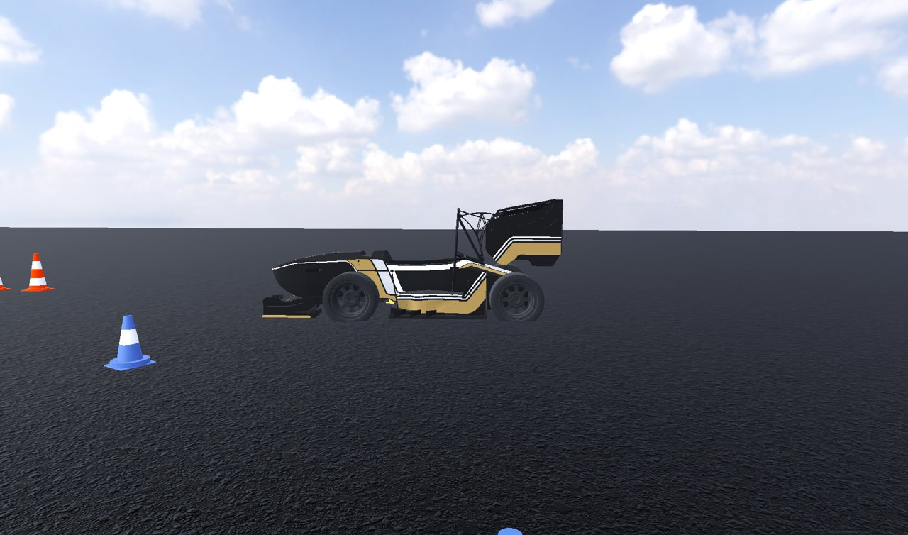
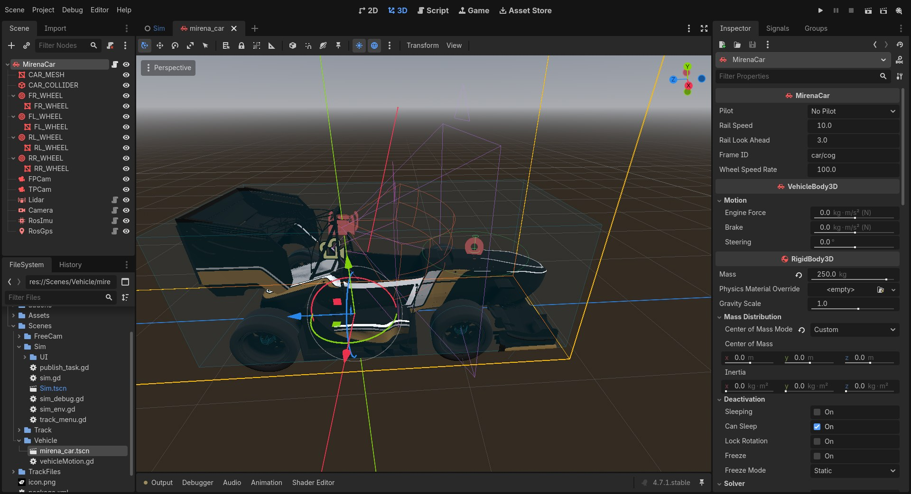
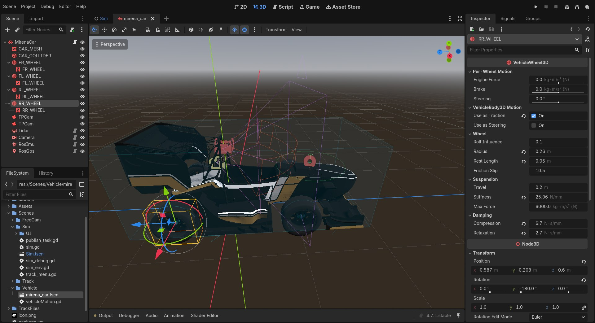
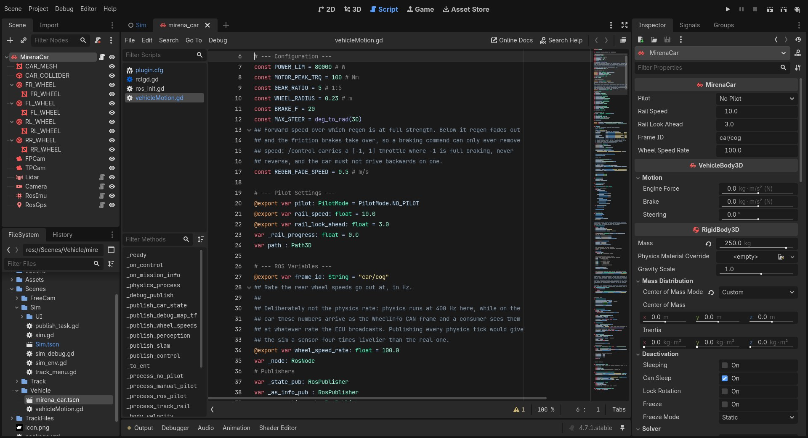

Vehicle configuration and customization
=======================================

The car is a single scene, ``Scenes/Vehicle/mirena_car.tscn``. Its root is a Godot
``VehicleBody3D`` running the ``MirenaCar`` script (``Scenes/Vehicle/vehicleMotion.gd``).
Everything that defines the car (mass, wheels, drivetrain constants, sensors) lives in this scene
and its script. You change the car by editing them in the Godot editor:

.. code-block:: bash

   ros2 run rclgd godot --editor --path src/mirena_sim

Then open ``res://Scenes/Vehicle/mirena_car.tscn`` from the FileSystem dock.

   The car scene in the editor. The Scene dock (left) shows the node tree. The 3D view shows the
   body, the collision box and the sensor gizmos. The Inspector (right) shows the ``MirenaCar``
   script variables at the top (pilot, rail settings, ``frame_id``, ``wheel_speed_rate``),
   followed by the ``VehicleBody3D`` and ``RigidBody3D`` properties: mass and centre of mass.

Scene structure
---------------

.. code-block:: text

   MirenaCar           VehicleBody3D   mass 250 kg, script vehicleMotion.gd
   ├── CAR_MESH        MeshInstance3D  visual body (Assets/Models/Car/TeR.res)
   ├── CAR_COLLIDER    CollisionShape3D  box 1.44 × 3.02 × 1.12 m
   ├── FL_WHEEL        VehicleWheel3D  steering
   ├── FR_WHEEL        VehicleWheel3D  steering
   ├── RL_WHEEL        VehicleWheel3D  traction
   ├── RR_WHEEL        VehicleWheel3D  traction
   ├── FPCam           Camera3D        viewer: onboard
   ├── TPCam           Camera3D        viewer: chase
   ├── Lidar           RosLidar        → car/lidar
   ├── Camera          RosCamera       → car/camera
   ├── RosImu          RosImu          → car/imu
   └── RosGps          RosGps          → car/gps

The root's origin is the car's reference point. The ``car/cog`` frame (``MirenaCar.frame_id``) is
published there, and every sensor's ``parent_frame_id`` is set to ``car/cog``. The physical centre
of mass is set separately (``center_of_mass_mode = custom``) in the inspector.

Vehicle model
-------------

Chassis and suspension
~~~~~~~~~~~~~~~~~~~~~~

Godot's ``VehicleBody3D`` is a **raycast vehicle**. Each ``VehicleWheel3D`` casts a ray down from
its mount point, a spring-damper produces the suspension force along that ray, and a friction
model produces longitudinal and lateral tyre forces at the contact point. The rigid body is
integrated by the physics engine at **400 Hz**.

All four wheels share these settings:

.. list-table::
   :header-rows: 1
   :widths: 35 20 45

   * - Property
     - Value
     - Meaning
   * - ``wheel_radius``
     - 0.26 m
     - Rolling radius used by the physics model
   * - ``wheel_rest_length``
     - 0.05 m
     - Suspension travel at rest
   * - ``suspension_stiffness``
     - 25.06
     - Spring rate
   * - ``damping_compression``
     - 6.7
     - Bump damping
   * - ``damping_relaxation``
     - 2.7
     - Rebound damping
   * - track / wheelbase
     - 1.174 m / 1.593 m
     - From the wheel mount positions (x = ±0.587, front z = −0.993, rear z = 0.6)

Tyre grip is set per wheel with ``wheel_friction_slip`` (10.5), and ``wheel_roll_influence``
(0.1) controls how much lateral force rolls the body.

   ``RR_WHEEL`` selected. *Per-Wheel Motion* sets whether the wheel is driven (``use_as_traction``)
   or steered (``use_as_steering``). *Wheel* and *Suspension* hold the tyre and spring-damper
   parameters listed above.

Drivetrain and braking
~~~~~~~~~~~~~~~~~~~~~~

The drivetrain is modelled in ``_apply_vehicle_physics`` from the constants at the top of the
script:

.. list-table::
   :header-rows: 1
   :widths: 30 20 50

   * - Constant
     - Value
     - Use
   * - ``MOTOR_PEAK_TRQ``
     - 100 Nm
     - Peak motor torque
   * - ``GEAR_RATIO``
     - 5
     - Motor-to-wheel reduction
   * - ``WHEEL_RADIUS``
     - 0.23 m
     - Converts wheel torque to force
   * - ``POWER_LIM``
     - 80 kW
     - Declared limit (not applied by the current model)
   * - ``BRAKE_F``
     - 20
     - Maximum friction brake value per wheel
   * - ``MAX_STEER``
     - 30°
     - Steering lock in Manual mode
   * - ``REGEN_FADE_SPEED``
     - 0.5 m/s
     - Speed below which regenerative braking fades out

The maximum tractive force is

.. math::

   F_{x,\max} = \frac{T_{\text{peak}} \cdot i}{r} = \frac{100 \cdot 5}{0.23} \approx 2174\ \text{N}

and the command ``gas`` ∈ [−1, 1] is split into throttle and braking:

.. math::

   F_x = \big(\max(g, 0) - \max(-g, 0)\cdot s_{\text{regen}}\big)\,F_{x,\max},
   \qquad s_{\text{regen}} = \operatorname{clamp}\!\left(\frac{u}{0.5\ \text{m/s}}, 0, 1\right)

:math:`F_x` is applied as ``engine_force`` split equally between the two rear wheels, which are the wheels with
``use_as_traction`` enabled. Braking is
regenerative above 0.5 m/s. Below that speed the friction brakes take over smoothly, so a braking
command brings the car to a stop and holds it there. **A negative gas never drives the car
backwards.**

Steering
~~~~~~~~

In ROS mode, ``steer_angle`` from ``/control`` is written straight to ``VehicleBody3D.steering``
(radians, positive turns left), which steers both front wheels by that angle. There is no
Ackermann correction and no actuator dynamics. Add them in ``_process_ros_pilot`` if your
controller needs them. In Manual mode, keyboard input is eased (smoothstep, rate 2/s) and scaled
to ``MAX_STEER``.

Pilot modes
-----------

``MirenaCar.pilot`` selects where the commands come from. Set it from the VEHICLE tab at runtime,
or in ``Scenes/Sim/Sim.tscn`` (the default there is **ROS**).

.. list-table::
   :header-rows: 1
   :widths: 20 80

   * - Mode
     - Behaviour
   * - ``NO_PILOT``
     - Zero gas and steering, brakes fully applied.
   * - ``MANUAL``
     - Keyboard or gamepad. :kbd:`Space` applies the emergency brake.
   * - ``ROS``
     - Uses the latest ``/control`` message. Brakes are left to the controller (negative gas).
       The last command persists until a new one arrives, so publish continuously.
   * - ``TRACK_RAIL``
     - Moves the car kinematically along the track centreline at ``rail_speed`` (10 m/s),
       facing a point ``rail_look_ahead`` (3 m) ahead. Useful for perception and SLAM tests that
       need a repeatable trajectory without a controller. Physics forces are bypassed in this mode,
       so IMU readings are not meaningful.

A minimal ROS driver looks like this:

.. code-block:: python

   import rclpy
   from rclpy.node import Node
   from mirena_common.msg import CarControl

   class Driver(Node):
       def __init__(self):
           super().__init__('driver')
           self.pub = self.create_publisher(CarControl, '/control', 10)
           self.create_timer(0.02, self.tick)          # 50 Hz

       def tick(self):
           msg = CarControl()
           msg.header.stamp = self.get_clock().now().to_msg()
           msg.gas = 0.2            # 20 % throttle
           msg.steer_angle = 0.15   # rad, left
           self.pub.publish(msg)

   rclpy.init(); rclpy.spin(Driver())

The car is reset to the track's start pose when you press *Reset Car Position*, when a track is
loaded, or when it falls below ``y = −1`` m.

ROS interface of the car
------------------------

``MirenaCar`` creates the ROS node ``mirena_car`` with absolute topic names:

.. list-table::
   :header-rows: 1
   :widths: 30 25 45

   * - Topic
     - Direction
     - Content
   * - ``/control``
     - sub
     - ``CarControl`` used in ROS mode
   * - ``/system/mission_status``
     - sub
     - ``MissionInfo`` displayed in the UI
   * - ``/sensors/wheel_speeds``
     - pub, ``wheel_speed_rate`` (100 Hz)
     - Rear wheel RPM from ``VehicleWheel3D.get_rpm()``, best effort. ``fl``/``fr`` are 0.
   * - ``/as_status``
     - pub, 10 Hz
     - AS state and mission from the VEHICLE tab
   * - ``/debug/state/car``
     - pub, every physics tick
     - Ground-truth ``Car`` state, zero covariance
   * - ``/debug/perception``, ``/debug/slam``, ``/inferred_control``
     - pub, 10 Hz
     - Ground truth for evaluation (see :ref:`simulator/overview:Topics`)
   * - TF ``car/cog → debug_odom → debug_map``
     - pub
     - Ground-truth pose (see :ref:`simulator/overview:TF tree`)

The wheel speed rate is deliberately lower than the physics rate. On the real car these values
arrive in a CAN frame at the ECU's broadcast rate, so the simulator doesn't provide a faster
sensor than the car has.

Customizing the car
-------------------

Changing physical parameters
~~~~~~~~~~~~~~~~~~~~~~~~~~~~

*Mass and inertia.* Select the ``MirenaCar`` root and edit ``mass`` and, under *Center of Mass*,
the custom ``center_of_mass``. Moving the centre of mass changes load transfer and handling
balance.

*Suspension and tyres.* Select each ``*_WHEEL`` node and edit the *Suspension* and *Wheel*
groups. Keep the left and right wheels symmetric. Increase ``wheel_friction_slip`` for more grip.

*Geometry.* Move the wheel nodes to change track and wheelbase. ``wheel_radius`` on the nodes is
what the physics uses. ``WHEEL_RADIUS`` in the script is only used to convert motor torque to
force, so keep the two consistent.

*Drivetrain.* Edit the constants at the top of ``vehicleMotion.gd``:

   ``vehicleMotion.gd`` in the script editor. The configuration constants and the exported pilot
   and ROS settings are at the top of the file.

Godot only applies ``engine_force`` to wheels with ``use_as_traction`` enabled. For four-wheel drive, enable
``use_as_traction`` on all wheels and split ``fx`` four ways in ``_apply_vehicle_physics``.

Changing the body
~~~~~~~~~~~~~~~~~

Replace the mesh of ``CAR_MESH`` with your own model (``.glb``, ``.res``). Then resize
``CAR_COLLIDER`` so it covers the body: the lidar and camera *see* the visual mesh, while cones
*collide* with the box. Viewer cameras (``FPCam``, ``TPCam``) can be moved freely and have no
effect on the ROS outputs.

.. tip::

   ``FPCam`` uses a ``cull_mask`` without layer 20. Put meshes you want hidden from the onboard
   view, such as the cockpit, on render layer 20. To hide something from a sensor, use that
   sensor's ``cull_mask`` the same way.

Adding, moving and removing sensors
~~~~~~~~~~~~~~~~~~~~~~~~~~~~~~~~~~~

Sensors are ordinary nodes. To add one:

1. Select the ``MirenaCar`` root and choose **Add Child Node** (:kbd:`Ctrl+A`). Search for
   ``RosLidar``, ``RosCamera``, ``RosImu`` or ``RosGps``. They are registered as global classes
   with their own icons, under ``Node3D → RosSensor``, and the dialog shows each one's
   description:

   .. image:: ../_static/images/editor_add_sensor.jpg
      :alt: Create New Node dialog with RosLidar selected under RosSensor
      :width: 70%

2. Position and orient it in the 3D view. The ``rclgd-sensors`` editor plugin draws a gizmo for
   each sensor: the camera frustum, the lidar's scan volume, the IMU's axes, and the GPS antenna
   with a ring of radius ``position_std``. Gizmos redraw as you edit the parameters.
3. In the inspector, set **ROS 2 Settings**:

   - ``frame_id``: for example ``car/lidar_front``. If left empty, the node name in snake_case is
     used.
   - ``parent_frame_id``: ``car/cog``, so the sensor joins the car's TF tree. The default
     ``~base_link`` resolves to ``<ros_namespace>/base_link``.
   - ``ros_namespace``: optional. Topics become ``/<namespace>/<node>/...``.
   - ``publish_rate``

4. Set the sensor model parameters in **Sensor Settings** (see :doc:`../sensors/index`).

The node name determines the ROS node name, and with it the topic. A ``RosLidar`` named
``LidarFront`` publishes on ``/lidar_front/lidar``. Rename nodes to get the topics you need, or
remap them with ``--ros-args -r``.

The mount transform is published once on ``/tf_static`` when the sensor starts, because sensors
are assumed to be rigidly attached. Moving a sensor while the simulator is running is not
reflected in TF.

Default sensor suite
~~~~~~~~~~~~~~~~~~~~

.. list-table::
   :header-rows: 1
   :widths: 14 34 52

   * - Node
     - Mount (ROS, relative to ``car/cog``)
     - Configuration
   * - ``Lidar``
     - x 0, y +0.049, z 1.0 m; pitched 10° down
     - 600 × 125 beams, 120° × 25° FOV, 0.1–200 m, 10 Hz, ``noise_std_dev`` 1 mm,
       ``face_resolution`` 2048
   * - ``Camera``
     - x 0, y −0.068, z 0.98 m
     - 640 × 480, 75° vertical FOV, 60 Hz, depth off
   * - ``RosImu``
     - z 0.149 m
     - Defaults (100 Hz)
   * - ``RosGps``
     - x 1.208, z 0.684 m
     - Defaults (10 Hz, 0.5 m / 1.2 m σ), frame ``car/gps``
